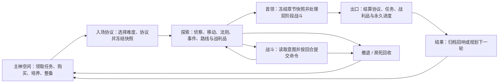

# 产品目标与不可丢失语义

## 1. 产品定位

《无限流》当前版本是一个用于验证原创“主神空间—副本轮回”循环的浏览器 MVP。它同时承担未来 App、小游戏或引擎客户端的规则原型职责。

MVP 的重点不是把所有机制做成永久占屏的信息，而是验证：

- 主神空间的长期成长是否能形成下一次出发的明确目标。
- 章节独特法则是否会改变路线和战斗决策。
- 本局构筑、风险、战利品与永久成长之间是否形成循环。
- 复杂机制能否通过状态摘要与 `?` 渐进披露，而不被界面简化删除。
- 局中刷新、退出、失败和旧档恢复是否保持规则一致。

因此，迁移不是“把网页重新画一遍”，而是“保留同一套规则、内容与状态契约，重写平台和表现层”。

## 2. 核心循环



阶段稳定枚举是：

```text
hub | explore | combat | result
```

迁移端可以把阶段映射为场景栈或页面路由，但不能改变合法状态组合：

- `hub`：没有活动 `run` 和 `combat`。
- `explore`：必须有活动 `run`，通常没有 `combat`。
- `combat`：必须同时有活动 `run` 和 `combat`。
- `result`：保存刚完成的结算信息，等待玩家返回大厅。

## 3. 十条不可妥协的语义

### 3.1 永久成长、本局快照、战斗态必须分层

- 大厅中的装备、功法、同伴、血统、宠物和整备属于聚合根中的长期状态。
- 只有规则明确声明为“入场冻结”的系统才写入 `DungeonRun`：携行、回响、器魂、铭刻勘探、装备记忆、同伴、功法、血统和章节入场被动等。
- 战斗回合和一次性技能使用记录属于 `CombatState`。
- 对上述显式快照，局中不得从大厅当前值重新推断或回填缺失值。
- 宠物是现行例外：它没有 run 快照，规则读取聚合根顶层 `activePet/petLevels`；局内成功捕获会立即切换 active，并可在本局后续战斗生效。迁移时不能为了“统一冻结”而臆造宠物快照。

这条规则既防止显式冻结系统被中途大厅配置改写，也保留宠物捕获即时入队的既有玩法；旧档只能按各系统真实所有权恢复，不能用一条笼统规则“猜测修复”成另一局。

### 3.2 战术携行与战利品袋是两套库存

- `tacticalLoadout` 决定本局允许使用哪些战术道具类型。
- `lootBag` 保存本局获得但尚未结算进主神空间的资源。
- 局内拾到某种道具，不代表本局一定可用；只有该类型已在入场携行快照中，拾取数量才可用于本局战斗或节点选择。
- 未携行类型必须先成功带回大厅，再在下一次入场前配置。

任何小游戏 UI 都必须让玩家能区分“主神空间库存”“本局可用量”“未结算战利品”。

### 3.3 章节法则、侵蚀、追兵和隐藏任务不是同一个风险条

- 章节法则：每章独有的动态规则与路线条件。
- 侵蚀：同一局首次清理非出口节点带来的全局压力段位；稳定、追猎、破界的出口基础加成分别为 15%、5%、0%。
- 追兵：复刷时在固定清理数后苏醒、沿真实路线追赶的实体。
- 隐藏路线契约：随机出现、按严格顺序完成的额外目标。

它们可以在 UI 中折叠，但不能合并成一个不透明的“危险值”。

### 3.4 首领路线门和出口封印必须分开

- 章节路线门决定能否抵达首领或特殊区域。
- `bossSeal` 表示击败首领后出口是否开放。
- 击败首领只解除出口封印，不会自动结束探索。
- 未击败首领时不能通过出口完成通关，但玩家仍可撤退。

不要重新使用“首领封印”同时指代路线前置和出口条件。

### 3.5 迷雾只隐藏从未侦察的远处内容

地图状态至少包含：

- 当前位置。
- 相邻且可见的节点。
- 曾经看见、当前不相邻的已侦察节点。
- 已清理节点。
- 从未侦察的远处迷雾。

相邻节点应显示类型和名称；离开后仍保留“已侦察”。问号只代表从未进入视野的远处内容。路线门关闭与迷雾不可混为一谈。

### 3.6 额外目标不能阻断主线

- 主神指令奖励主题化或稳定的通关方式，但失败不阻止首领与出口。
- 隐藏任务无需入场预选，错过或失败不阻断主线。
- 装备记忆和铭刻勘探是可选长期成长目标。
- UI 中的“当前满足”可能在后续行动中失效；只有结算时才锁定最终结果。

### 3.7 法则待选通常只锁地图移动

因果账本、航向、相位、条款、拍品、基因、广播、护送、裁定、复演路线和监察路线等选择，会暂停相邻移动，但角色、任务、帮助、撤退等全局能力仍应可用。

小游戏不能把这些选择做成无法返回、无法查看说明、无法撤退的全屏死锁。

### 3.8 战斗是命令驱动的回合系统

- 战斗暂停地图探索。
- 每个主要行动通常推进一回合。
- 敌方意图提供下一步后果、推荐反制和高风险提示。
- 推荐必须基于当前真正可执行的动作。
- 器魂、同伴助战、每门入场功法战技与血统爆发遵守各自次数和快照规则。
- 只有胜利、捕获、主动撤离或濒死回收会结束战斗。

迁移端可以更换动画、布局与镜头，但不能把命令结算改成不可审计的实时战斗。

### 3.9 一个物理输入最多提交一次

当前 Web 通过 `action-input-guard.ts` 防止双击、长按和 DOM 重建造成重复结算，同时允许玩家快速连续执行不同动作。

小游戏必须保留同一业务不变量：

- 同一物理触摸或按键只产生一个领域命令。
- 不同动作可以快速连用。
- 防重复不能依赖按钮是否已经被重新渲染。

### 3.10 玩家文案与结构化状态分离

- 玩家界面使用中文、可理解的状态和帮助。
- 存档、规则与分析使用稳定英文 ID 和枚举。
- 本地化不能重命名稳定 ID。
- 历史英文枚举可以在显示层翻译，但 raw 存档不应被文案替换。

## 4. 渐进披露契约

副本主界面只常驻显示：

- 当前状态和关键数值。
- 下一步目标。
- 当前可执行动作。
- 会直接影响当下决策的风险。

完整机制背景放在功能名称旁的 `?` 中。跨端权威源是：

```text
src/dungeon-feature-help.ts
```

每个稳定 help ID 固定包含：

- `title`：显示标题。
- `summary`：是什么。
- `mechanic`：怎样影响本局。
- `guidance`：现在怎么做。
- `readout`：界面怎么看。
- `keywords`：检索词。

小游戏应使用点击、长按或独立说明页承载这些字段。不能因为没有 hover 就删除说明，也不能只复制一行 `summary` 而丢掉其余字段。

## 5. 当前稳定帮助主题

当前有 23 个稳定 help ID：

```text
difficulty
playerPower
infernoTier
proceduralMap
equipmentRoll
hiddenTask
directive
pressure
pursuit
companion
combatFlow
method
tacticalLoadout
fieldSurvey
soulSkill
relic
law
lawSector
equipmentHunt
equipmentMemory
lootBag
bossSeal
fogMap
```

其中 `equipmentHunt` 必须同时保留：

- 当前流程：首领或精英三选一 + 章节材料定向兑换。
- 旧档兼容：历史定向追猎目标、线索和首个精英报价。

这两层不得混用：现代新局只从当前入口创建现行状态；legacy 字段、归一化分支和历史目录只用于识别、恢复或解释旧档，不是新局的可选流程。静态搜索到一个导出、类型或测试用例，不足以证明它属于现行流程；还必须证明它可从当前 UI/命令入口到达，并被“新建一局”的回归事实覆盖。

“legacy”也可能只是现行内容的英文稳定 ID，例如 `legacy_auction_court`；是否属于兼容 API 要依据调用语义和入口可达性，不能依据名称猜测。看似已从新界面删除的旧规则，只要仍影响旧档，就必须保留说明和迁移语义。

## 6. 结算语义

战利品袋结算的核心边界：

- 成功通关：带回全部符合规则的奖励。
- 清理至少 3 个非出口节点后主动撤退：带回 50% 奖励点，装备不能带回。
- 清理至少 3 个非出口节点后濒死回收：带回 20% 奖励点，装备不能带回。
- 不足 3 个非出口节点时离开：袋中收益尚未固化，全部遗失。
- 临时回响在离开副本后失效；成功通关时可选择归档一件，作为未来首轮候选种子。
- 隐藏任务、追兵材料、协议、委托和装备记忆各自独立结算，不能仅以一个“胜利奖励”字段替代。

## 7. 设计变更判断

如果未来迁移中想简化某个机制，先回答：

1. 它是否存在稳定 ID 或存档字段？
2. 它是否参与入场冻结、路线门、结算或旧档兼容？
3. 它是否有 `?` 帮助条目？
4. 它是否被单元测试、平衡模拟或 UI smoke 验证？
5. 简化后能否仍从界面访问完整背景？

任意一项为“是”，就不能只删 UI；必须先设计数据迁移、帮助保留和等价验收。
