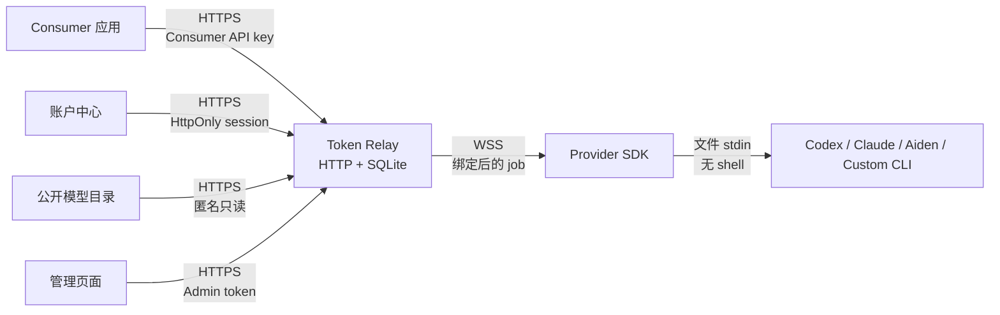

# Token Relay

Token Relay 是一个有明确绑定、额度限制和积分结算的模型请求中转服务。Provider
可以主动把模型列入公开目录；Consumer 只能绑定本人 Provider，或另一位用户明确
列出、当前在线并实际提供该模型的 Provider。Provider 在自己的设备安装 SDK，由
SDK 建立出站 WebSocket 连接并启动本地 Codex、Claude、Aiden 或自定义模型 CLI。
Relay 不需要也不应获得 Provider 的上游订阅凭据。

网站用户可以直接注册用户名和密码登录。每位新用户获得一次初始积分，既可以作为
Consumer 消耗模型，也可以作为 Provider 提供模型并赚取积分；同一账户可以同时
承担两种角色。用户会话与 Admin token 严格分离，资源管理仍按所有者隔离。

当前版本实现 OpenAI-compatible 的非流式
`POST /v1/chat/completions`，以及供 Claude Code 使用的 Anthropic Messages
`POST /v1/messages`（流式和非流式纯文本子集），以及无需登录即可浏览的模型目录
`GET /models` / `GET /catalog/v1/models`。积分仅是 Relay 内部的一比一 Token
记账单位，不可充值、提现或兑换现金。它仍是单服务、单 SQLite 数据库的 MVP，
不是支付、计费、Token 转售或高可用平台。

## 架构



```text
token-relay/
  apps/relay-server/              中心 HTTP、WebSocket、SQLite 与管理页面
  packages/protocol/              Relay 与 SDK 的共享协议类型
  packages/provider-sdk/          Provider 安装的 SDK 与 CLI
  docs/protocol.md                HTTP、Admin 与 Provider WebSocket 协议
  docs/threat-model.md            信任边界、控制和剩余风险
  test/                           端到端与协议测试
```

## 要求

- Node.js 22.13 或更新版本。
- npm。
- Provider 设备上至少安装并登录一个受支持的 CLI：`codex`、`claude`、`aiden`，
  或准备一个自定义可执行程序。
- 跨设备或公网部署时必须有 HTTPS/WSS 反向代理。
- 用户名和密码只通过 HTTPS 提交；回环 HTTP 仅用于本机开发。

## 启动中心服务

在仓库的 `token-relay/` 目录执行：

```bash
npm install
cp .env.example .env
```

生成高熵 Admin token：

```bash
node -e "console.log(require('node:crypto').randomBytes(32).toString('base64url'))"
```

将结果写入 `.env` 的 `TOKEN_RELAY_ADMIN_TOKEN`，然后构建并启动：

```bash
npm run build
node --env-file=.env apps/relay-server/dist/cli.js
```

默认地址：

- 账户中心：`http://127.0.0.1:8787/`
- 管理页面：`http://127.0.0.1:8787/admin`
- 健康检查：`http://127.0.0.1:8787/health`
- OpenAI-compatible base URL：`http://127.0.0.1:8787/v1`
- Claude Code `ANTHROPIC_BASE_URL`：`http://127.0.0.1:8787`
- Provider WebSocket：`ws://127.0.0.1:8787/provider/v1/connect`

也可以在已导出环境变量的 shell 中使用 workspace 命令：

```bash
npm run start -w @token-relay/relay-server
```

常用中心配置：

| 环境变量 | 默认值 | 说明 |
| --- | --- | --- |
| `TOKEN_RELAY_HOST` | `127.0.0.1` | HTTP 监听地址 |
| `TOKEN_RELAY_PORT` | `8787` | HTTP 监听端口 |
| `TOKEN_RELAY_DATABASE` | `./data/token-relay.db` | SQLite 路径；测试可用 `:memory:`。POSIX 系统上的父目录必须为 `0700` 或更严格 |
| `TOKEN_RELAY_ADMIN_TOKEN` | 无 | 必填，至少 24 个字符 |
| `TOKEN_RELAY_PUBLIC_URL` | 本地自动推导 | 对外精确 origin；默认回环启动无需配置，非回环部署必须显式设置 HTTPS origin |
| `TOKEN_RELAY_USER_SESSION_TTL_MS` | `2592000000` | 用户本地会话寿命，默认 30 天 |
| `TOKEN_RELAY_INITIAL_POINTS` | `100000` | 新用户及首次迁移的旧用户一次性初始积分；修改后不会重置已有账户 |
| `TOKEN_RELAY_REQUEST_TIMEOUT_MS` | `300000` | Consumer 请求超时 |
| `TOKEN_RELAY_PROVIDER_ONLINE_MS` | `45000` | Provider 心跳在线窗口 |
| `TOKEN_RELAY_LEASE_MS` | `360000` | job 租约上限 |
| `TOKEN_RELAY_CORS_ORIGIN` | 空 | 默认不启用 CORS；生产只填精确可信 origin |

停止服务时发送 `SIGINT` 或 `SIGTERM`，服务会关闭 Provider 连接并关闭数据库。

## 注册和登录

打开 `/` 即可注册或登录，不需要配置第三方身份平台：

- 用户名会先去除首尾空白、执行 Unicode NFKC 规范化并转为小写；规范化后必须为
  3–64 位 ASCII，只允许小写字母、数字、点、下划线和连字符。用户名按规范化值
  大小写不敏感地唯一。
- 密码必须为 12–128 个 Unicode code point，UTF-8 编码不超过 512 字节。Relay
  使用带独立随机盐和明确参数的 `scrypt` 哈希；SQLite 不保存明文密码。
- 显示名称可选，去除首尾空白后为 1–64 个字符；不填时使用规范化用户名。

注册或登录成功后，Relay 颁发高熵随机 opaque session。SQLite 只保存 session
哈希；浏览器 Cookie 使用 `HttpOnly; SameSite=Lax; Path=/`，生产 HTTPS 下额外使用
`Secure` 和 `__Host-` 前缀。登录失败对“用户不存在”“密码错误”和“账户已禁用”
统一返回 `invalid_credentials`，并有进程内失败尝试限流，避免泄漏账户是否存在。

默认 `127.0.0.1:8787` 启动会自动使用 `http://127.0.0.1:8787` 作为同源基准，无需
设置 `TOKEN_RELAY_PUBLIC_URL`。绑定非回环地址或部署到公网时，必须将
`TOKEN_RELAY_PUBLIC_URL` 显式设为浏览器实际访问的 HTTPS origin；反向代理还应固定
Host 并启用 HSTS。所有注册、登录、退出和账户写操作都要求 `Origin` 与该基准精确
一致，`Sec-Fetch-Site: cross-site` 会被拒绝。

当前版本已移除微信扫码 OAuth，不再读取任何 `TOKEN_RELAY_WECHAT_*` 配置；升级时应
从部署环境和密钥管理中删除这些旧变量。全新数据库不会创建微信 identity/state 表。
为了避免升级时静默销毁数据，已有数据库中的旧表不会自动 DROP，但运行时完全不再
读取它们。旧版只有微信身份、没有密码 identity 的账户不能直接登录；生产旧库升级
前必须另行安排账户迁移或资源归属处理，MVP 暂无账号恢复、合并或设置初始密码流程。

## 用户中心

登录后的 `/`（或 `/dashboard`）只调用 Cookie 会话保护的 `/account/v1/*`：

- 创建自己的 Provider 并一次性领取 Provider token；自助创建默认明确选择公开列出，
  之后可以随时关闭公开；
- Provider SDK 上线并上报模型后，创建绑定到本人 Provider 或目录中其他 Provider
  的 Consumer；
- 一次性领取 Consumer API key；
- 查看积分余额、预留积分、Consumer 消耗 Token、Provider 提供 Token、自己的资源
  和请求记录。

用户会话不能访问 `/admin/v1/*`，Admin Bearer token 也不能冒充用户会话。跨用户
资源的修改和密钥轮换返回 `404`。公开目录只暴露 Provider 名称、模型类别、最后
上报的模型和在线/可接入状态，不暴露所有者身份、凭据、额度、积分或请求详情。

跨用户创建 Consumer 时，Provider 必须同时满足：由所有者主动设为 `listed`、已启用、
当前在线，而且当前连接仍实际上报所选模型。目录会保留已列出 Provider 最后一次上报
的模型供离线浏览，但离线条目不能接入。关闭公开只阻止新的跨用户绑定，不会暗中断开
已经存在的 Consumer；本人始终可以绑定自己的未公开 Provider。

每个新用户默认一次获得 `100000` 积分。跨用户请求在派发前按“Relay prompt 输入估算
与最大输出之和”预留等量积分，Provider 完成后按完整的 accountable Token 用量一比一
结算。若实际用量超过预留，Consumer 余额可以变为负数，同时 Provider 仍获得完整
积分；负的可用余额会阻止后续跨用户预留。同一账户调用自己的 Provider 不要求余额，
但仍写入一条 Consumer 消耗和一条 Provider 收益记录，二者相抵、净余额不变。Admin
或旧版 `owner_user_id = NULL` 资源不参与积分结算。

## 通过管理页面完成配置

1. 打开 `/admin`，输入 `.env` 中配置的 Admin token。Admin 是独立的全局运维入口，
   不接受普通用户会话。页面只将 token 放入当前标签页的 `sessionStorage`，不会写入
   Cookie 或 `localStorage`。
2. 在“创建 Provider”输入易识别的设备或提供者名称。创建成功后立即复制
   `providerToken`；完整 Token 只显示一次。数据库层的 `listed` 默认值为 `false`；
   用户自助创建会显式选择公开，Admin 创建时应按实际用途明确配置。
3. 在 Provider 设备配置并启动 SDK。回到管理页刷新，确认 Provider 显示“在线”，
   并核对它上报的模型名称。
4. 创建 Consumer，选择该 Provider，填写与 SDK 配置完全一致的模型名，并设置：
   - `tokenLimit`：Consumer 可使用的 Token 总额度；
   - `maxConcurrent`：该 Consumer 同时可运行的最大请求数。
5. 立即复制新 Consumer 的 API key。完整 key 同样只显示一次。
6. 使用页面中的 Provider/Consumer 状态、配额进度和最近请求检查路由、错误与用量。

Provider 离线、Consumer 停用、模型未上报、额度耗尽或并发已满时，请求会被拒绝，
不会静默改派到其他 Provider。

## 安装并启动 Provider SDK

发布包安装方式：

```bash
npm install -g @anarkhli/provider-sdk
token-relay-provider version
```

在 Provider 设备创建 `provider.config.json`。下面示例只上报一个名为
`gpt-5.6-sol` 的模型；这个对象键就是管理页创建 Consumer 时要填写的模型名：

```json
{
  "relayUrl": "wss://relay.example.com/provider/v1/connect",
  "providerToken": "${TOKEN_RELAY_PROVIDER_TOKEN}",
  "concurrency": 1,
  "models": {
    "gpt-5.6-sol": {
      "adapter": "codex",
      "command": "codex",
      "cliModel": "gpt-5.6-sol"
    }
  }
}
```

把管理页只展示一次的 Provider token 放入环境变量，不要把它直接提交到配置文件：

```bash
export TOKEN_RELAY_PROVIDER_TOKEN='tr_provider_替换为真实值'
token-relay-provider doctor --config provider.config.json
token-relay-provider start --config provider.config.json
```

`doctor` 检查配置和目标命令是否可执行；通过后再用 `start` 建立连接。SDK 会自动心跳和
断线重连，并在 `SIGINT`/`SIGTERM` 时取消进行中的任务。Relay 会保存最近一次成功
上报的模型用于目录展示；这份历史能力记录本身不表示当前可接入。跨用户新建
Consumer 仍要求 Provider 已公开、启用、实时在线且当前连接实际 advertise 该模型。

SDK 支持以下 adapter：

| adapter | 默认命令 | 默认执行边界 |
| --- | --- | --- |
| `codex` | `codex` | 临时空 workspace、read-only sandbox、非 TTY 文件 stdin |
| `claude` | `claude` | 临时空 workspace、plan permission mode、非 TTY 文件 stdin |
| `aiden` | `aiden` | 临时空 workspace、readOnly permission mode、提示文件 |
| `custom` | 必须配置 | 直接 spawn，无 shell；隔离责任由自定义命令承担 |

完整配置模板见
[`packages/provider-sdk/provider.config.example.json`](./packages/provider-sdk/provider.config.example.json)。
`custom.args` 可使用 `{model}`、`{workspace}`、`{promptFile}` 和 `{outputFile}`
占位符。SDK 默认只继承小范围安全环境变量；额外凭据必须逐项写入 `inheritEnv`，
不要继承整个进程环境。

可选 Provider 环境变量：

| 环境变量 | 说明 |
| --- | --- |
| `TOKEN_RELAY_PROVIDER_CONFIG` | 默认配置文件路径 |
| `TOKEN_RELAY_PROVIDER_TOKEN` | Provider Bearer token |
| `TOKEN_RELAY_URL` | 覆盖 Relay `ws://`/`wss://` 地址 |
| `TOKEN_RELAY_DEBUG=1` | 启用脱敏调试日志 |

## 浏览公开模型目录

`GET /models` 是无需登录的模型目录页面，数据来自匿名只读的
`GET /catalog/v1/models`。目录按模型名分为 `GPT`、`Claude`、`Gemini`、
`DeepSeek`、`Qwen`、`Doubao` 和 `Other`；名称同时包含 `deepseek` 与 `qwen`
时优先归入 `DeepSeek`。页面可以按类别筛选，登录后可从当前可接入的条目直接创建
Consumer。

目录只显示 `listed = true` 且已启用的 Provider。离线 Provider 仍显示最后一次
成功上报的模型和“离线”状态，便于发现供给，但不能创建新的跨用户 Consumer。
`available = true` 只表示服务器在本次读取时观察到 Provider 在线且当前连接实际
advertise 该模型；它不是持续可用性承诺。Consumer 创建和真正请求都会重新校验，
不会因目录缓存静默改派到其他 Provider。

## 发起 OpenAI-compatible 请求

把管理页生成的 Consumer API key 放在调用方环境变量：

```bash
export TOKEN_RELAY_BASE_URL='https://relay.example.com'
export TOKEN_RELAY_API_KEY='tr_consumer_替换为真实值'
```

查看该 key 被允许使用的模型（这是该 Consumer 的授权列表，不是公开目录）：

```bash
curl --fail-with-body \
  "$TOKEN_RELAY_BASE_URL/v1/models" \
  -H "Authorization: Bearer $TOKEN_RELAY_API_KEY"
```

发送聊天请求：

```bash
curl --fail-with-body \
  "$TOKEN_RELAY_BASE_URL/v1/chat/completions" \
  -H "Authorization: Bearer $TOKEN_RELAY_API_KEY" \
  -H "Content-Type: application/json" \
  -d '{
    "model": "gpt-5.6-sol",
    "messages": [
      {
        "role": "user",
        "content": "请用三点解释为什么请求会超时。"
      }
    ],
    "max_tokens": 600,
    "temperature": 0.2,
    "stream": false
  }'
```

响应使用标准 `chat.completion` 外形并包含 `usage`。输入用量包含 SDK 为安全传递
角色与输出上限而添加的固定 Relay prompt 包装；中心与内置 SDK 共用同一估算函数。
OpenAI-compatible 接口当前不支持 `stream: true`、工具调用、图片、音频或文件。

跨所有者请求的积分预留量为：

```text
R = estimateRelayPromptTokens(job) + maxOutputTokens
```

只有 Consumer 所有者的 `availablePoints` 足以覆盖 `R` 才会预留。最终结算不以
`R` 封顶：Relay 按校验后的完整 accountable `usage.totalTokens` 从 Consumer
扣除并等额计入 Provider。实际用量高于 `R` 时余额可能变负，这是明确记录的超额，
而不是被丢弃的 Provider 工作量。Provider 未接受任务前的失败会完整释放预留且不
产生收支；重复或迟到结果不能重复结算。

## 通过 Claude Code / Anthropic Messages 请求

Claude Code 可把 Relay 根地址和 Consumer API key 分别配置为
`ANTHROPIC_BASE_URL` 与 `ANTHROPIC_AUTH_TOKEN`：

```bash
export ANTHROPIC_BASE_URL='https://relay.example.com'
export ANTHROPIC_AUTH_TOKEN='tr_consumer_替换为真实值'
export CLAUDE_CODE_MAX_OUTPUT_TOKENS=512
export MAX_THINKING_TOKENS=0
claude --model 'claude-relay' --max-turns 1 --tools '' -p '只回复 relay-ok'
```

其中 `--model` 必须与 Consumer 绑定模型完全相同；较低的输出上限也必须能被该
Consumer 的剩余额度完整预留。Claude Code 发送的
`POST /v1/messages?beta=true`、Bearer token、顶层 `system`、字符串或有序
`text` blocks、`cache_control`、`metadata`、`output_config`、空 `tools` 和
`stream: true` 均可兼容。普通 Anthropic 客户端也可使用 `x-api-key`，以及
`stream: false` JSON 响应。

Relay 的 Provider 协议只返回最终文本，因此 Anthropic SSE 会在 Provider 完成后
按 `message_start` 到 `message_stop` 的标准事件顺序一次性发出，而不是实时增量。
非空工具定义、`tool_use` / `tool_result`、图片及其他非文本内容会收到明确的
Anthropic 风格 `invalid_request_error`；当前 Relay 不提供 Claude Code 的工具
执行能力。

## 验证

从 `token-relay/` 执行：

```bash
npm run typecheck
npm test
```

`npm test` 会先构建所有 workspace，再运行协议、管理鉴权、账号注册和密码登录、
公开目录分类与脱敏、跨用户 opt-in 绑定、双角色账户、积分预留/完整结算/幂等、
账户级并发、旧数据库一次性迁移、一次性密钥、Provider 连接、Consumer 路由、
Token 额度和失败回收等测试。

## 生产安全边界

上线前至少满足以下条件：

- Relay 默认只监听回环地址。由受控反向代理提供 HTTPS/WSS，不要把明文 HTTP/WS
  暴露到公网。
- Admin 页面应限制在 VPN、内网或额外的访问控制之后。Admin token 使用至少
  32 字节随机值，并放入密钥管理系统，而不是镜像、Git 或命令历史。
- `.env`、SQLite、WAL 文件和备份仅服务账户可读。Relay 会以私有 umask 创建默认
  数据目录，将数据库及 WAL/SHM 设为 `0600`，并拒绝 POSIX 系统上权限过宽的自定义
  数据目录。访问日志和应用日志不得记录 Authorization header、完整密钥、
  `leaseToken` 或消息正文。
- 用户名、密码、密码哈希和会话 Cookie 不得进入访问日志、错误追踪或前端分析系统。
  对 `/auth/v1/register` 和 `/auth/v1/login` 设置服务端与反向代理速率限制；不要
  依赖单进程内存限流作为分布式防护。
- 生产 `TOKEN_RELAY_PUBLIC_URL` 必须是外部真实 HTTPS origin。反向代理应固定 Host、
  设置 HSTS，并只把流量转发给回环监听的 Relay；不要根据不可信
  `X-Forwarded-*` 动态决定账号请求的可信 origin。
- CORS 默认保持关闭；若浏览器 Consumer 确有需要，只配置一个精确可信 origin，
  不要使用 `*`。
- Provider 是请求内容的数据接收方。只绑定你信任的 Provider，并让 Consumer 明确
  知道消息会在该设备处理。公开列出表示允许他人发现和新建绑定，不代表 Relay 已
  审核 Provider 身份、模型真实性或内容处理承诺。
- Provider 使用独立低权限系统账户或容器。即使 SDK 默认以只读模式启动 CLI，
  CLI 登录态和自定义 adapter 仍可能拥有本地文件或命令权限。
- Relay 永远不应收集 Provider 的上游 API key、Cookie、订阅登录态或主目录。它只
  保存 Provider token 的哈希，并把 job 发到 Provider 主动建立的 WSS 连接。
- Token 统计和积分可能来自文本估算，不能直接作为付款或法定账务依据。中心会在
  派发前预留“Relay prompt 估算 + 最大输出”，并按经过下界和异常值校验的完整
  usage 一比一结算。若 CLI 忽略输出上限，积分扣款可以高于预留并使 Consumer
  余额为负；后续跨用户请求会被积分检查拒绝。积分没有现金价值或提现能力。
- SQLite 单实例适合 MVP；多实例需要共享 Provider 连接路由、分布式租约和数据库
  原子预留设计，不能直接复制进程横向扩容。
- 在向第三方提供服务前，确认模型订阅条款是否允许此类远端代理、共享或商业使用。

完整控制、剩余风险和上线清单见
[`docs/threat-model.md`](./docs/threat-model.md)。接口和消息格式见
[`docs/protocol.md`](./docs/protocol.md)。
