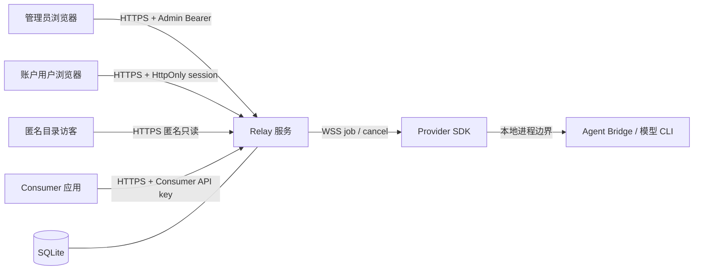

# Token Relay 威胁模型

本文描述 Token Relay MVP 的信任边界、主要威胁、已有控制和生产部署仍需承担的
风险。它不是第三方安全审计，也不代表任何模型订阅服务允许共享或转售额度；部署者
和 Provider 必须自行确认上游服务条款、组织政策与适用法律。

## 安全目标

Token Relay 需要保证：

1. Consumer 只能调用管理员或资源拥有者明确绑定的 Provider 和模型。
2. Consumer 与 Provider 的 Token/并发限制不能被并发请求绕过。
3. Admin token、Provider token、Consumer API key 和 job lease 不出现在数据库
   明文、普通日志、管理列表或错误消息中。
4. Provider 的上游 API key、登录态或订阅凭据始终留在 Provider 设备，Relay 不
   接收也不转发这些凭据。
5. 一个 Provider 不能提交另一个 Provider 的结果；过期或重复 job 不能重复结算。
6. 请求失败和 Provider 断线后，预留配额与并发槽能够回收，并保留足够但已脱敏的
   诊断信息。
7. 账号密码登录不能授予 Admin 权限；用户只能看到和管理 `owner_user_id` 为自己的
   资源。
8. 明文密码和本地会话 token 不能进入持久化、日志或错误；登录失败不能泄漏用户名
   是否存在。
9. 公开目录只能展示 Provider 主动 opt-in 的脱敏能力；目录可见性不能替代实时授权。
10. 跨用户积分预留、完整结算和双边账本不能被并发、重放或同账户双角色绕过；积分
    不得被描述为现金、法币或可提现资产。

可用性、回答正确性、Provider 对内容的保密承诺和上游账户持续可用性不属于 Relay
能够单方面保证的性质。

## 资产

- Admin token，以及管理配置的完整读写权限。
- Provider token、Consumer API key 与它们的哈希。
- Consumer 到 Provider/模型的绑定关系。
- Consumer 与 Provider 的 Token 额度、已用量、预留量和并发状态。
- Consumer 消息正文、Provider 模型输出和可推断出的业务信息。
- Provider 设备上的模型 CLI 登录态、上游 API key、文件访问权和本地工作目录。
- job id、随机 `leaseToken`、请求状态与使用量。
- 用户名、密码、密码哈希和显示名称。
- 本地用户 session、资源所有权关系和登录元数据。
- 用户积分余额/预留、初始赠送和关联 request 的收支账本。
- Provider 的公开列出选择、最后上报模型、目录类别与在线/可接入状态。
- SQLite 数据库、备份、环境变量、反向代理配置和运行日志。

## 信任边界

- Admin 浏览器拥有最高权限，必须被视为高价值终端。
- 用户会话不是管理员凭据；自动附带 Cookie 的认证/账户 API 必须同时防御 CSRF。
- 匿名访客只能读取经过最小化的目录投影，不能用目录接口探测所有者或私有配置。
- Consumer、Provider 与公网均不可信；即使它们持有合法凭据，也只能在自己的
  授权范围内操作。
- Relay 可读取转发中的消息正文，因此部署者是数据处理方。
- Provider 必须读取分配给它的消息并生成答案；Consumer 应明确知道其内容会暴露给
  所绑定的 Provider。
- 本地模型 CLI 可能拥有 Provider 主机的文件或命令权限。Provider SDK 不能把远端
  消息当作控制参数直接拼接进 shell。

## 威胁与控制

### 凭据泄漏

**威胁：** 密钥进入 Git、浏览器持久存储、截图、日志、数据库、代理 access log、
错误堆栈或聊天记录。

**控制：**

- `.env` 被仓库忽略，只提交不含真实密钥的 `.env.example`。
- Provider token 与 Consumer API key 使用高熵随机值，服务端只保存 SHA-256 哈希
  和短前缀，完整值仅在创建或轮换响应中出现一次。
- 密码使用带独立随机盐和受控参数的 `scrypt` 哈希，数据库只持久化编码后的参数、
  盐和摘要。用户 session 使用独立高熵随机值，SQLite 只保存其 SHA-256 哈希。
- 生产 Cookie 使用 `__Host-`、`Secure`、`HttpOnly`、`SameSite=Lax` 和 `Path=/`；
  回环 HTTP 仅用于本机开发，不设置 `Secure` 且不使用 `__Host-` 前缀。
- Admin token 仅从进程环境读取；管理页只放入 `sessionStorage`，退出或关闭标签页
  后清除，不使用 Cookie 或 `localStorage`。
- 管理 API、密钥响应和管理页面都应设置 `Cache-Control: no-store`。
- 日志只记录内部 id、密钥前缀和错误码，不能记录 Authorization / `x-api-key`
  header、完整 URL query、消息正文、`leaseToken` 或完整响应对象。
- 生产环境只允许 HTTPS/WSS。Relay 在 POSIX 系统上以私有 umask 创建数据库文件，
  要求数据目录权限不宽于 `0700`，并把数据库与已创建的 WAL/SHM 文件设为 `0600`；
  备份仍需由部署方使用同等级操作系统权限与磁盘加密保护。

**剩余风险：** XSS、恶意浏览器扩展、管理员终端被控、进程内存转储和 Provider
主机被控仍可获得当前有效凭据。SQLite 中的用户名、显示名称、密码哈希与资源归属
仍是敏感账户信息；备份泄漏会支持离线密码猜测。

### 密码猜测、账号枚举和会话固定

**威胁：** 攻击者批量枚举用户名、在线猜测弱密码、利用 Unicode 或大小写注册相同
账号、窃取/固定 session，或通过跨站表单在受害者浏览器注册、登录、退出和修改资源。

**控制：**

- 用户名执行 `trim + NFKC + lowercase` 后用数据库唯一约束，结果限制为 3–64 位
  `[a-z0-9._-]`；登录使用同一规范化流程。
- 密码限制为 12–128 个 Unicode code point，并限制 UTF-8 字节数；使用 `scrypt`
  和每账户随机盐，验证采用恒定时间摘要比较。
- 用户不存在、密码错误和账户禁用都返回 `invalid_credentials`，不返回用户资料。
- 服务内按来源和账号维护有界失败计数并短期限流；生产反向代理必须再做独立限流。
- 注册、登录、退出和账户 mutation 只接受 JSON，并要求精确同源 `Origin`；
  `Sec-Fetch-Site: cross-site` 直接拒绝。
- 每次成功注册/登录都颁发新的 opaque session；数据库只存哈希，Cookie 为
  HttpOnly、SameSite=Lax、Path=/ 且有界过期，HTTPS 额外使用 Secure/__Host-。

**剩余风险：** MVP 没有邮件验证、多因素认证、找回密码、全设备退出或共享分布式
限流；密码数据库泄漏仍允许离线猜测。单进程内存限流在重启后清空，也不能跨多个
实例聚合。部署者必须在反向代理增加持续限流、监控与封禁策略。

从旧微信 OAuth 版本升级时，Relay 不再读取旧 identity/state，也不会在全新数据库
创建对应表；为避免自动销毁数据，迁移不会 DROP 已存在的旧表。它们及其备份仍含
历史个人信息，必须继续按敏感数据保护。只有旧微信 identity、没有密码 identity 的
账户无法直接登录，部署者必须在上线前制定账户/资源迁移与旧数据保留删除方案。

### 公开目录枚举与意外曝光

**威胁：** Provider 在未同意时被公开；匿名访客通过目录枚举用户身份、凭据前缀、
额度、积分、请求统计或设备细节；离线/过期能力被误认为当前可用；攻击者利用模型名
分类或筛选绕过跨用户绑定检查。

**控制：**

- 数据库 `listed` 默认 `false`；用户自助创建虽显式选择公开，页面必须清楚解释公开
  效果并允许所有者关闭。只有 `listed && enabled` 的 Provider 进入目录。
- 目录使用单独的公开投影，只返回 Provider 的公开 id/名称、规范化模型、类别、
  最后上报时间以及在线/可接入布尔值。严禁复用包含 `ownerUserId`、Token 前缀、额度、
  积分、并发计数或请求详情的管理/账户对象。
- 离线 Provider 可以显示最后上报模型，但必须明确 `online = false`、
  `available = false`。跨用户创建 Consumer 时重新要求实时在线且当前连接实际
  advertise 精确模型名，不能信任浏览器提交的类别或缓存。
- 取消列出立即阻止新的跨用户绑定，不删除、不改派既有 Consumer；同所有者私有绑定
  不依赖公开目录。
- 类别只用于展示。分类顺序固定，`deepseek` 优先于 `qwen`，不能影响模型精确匹配。

**剩余风险：** Provider 名称和公开模型本身可能泄露组织、地理位置或使用习惯；所有
者在命名和 opt-in 前必须理解它们对匿名访客可见。目录不验证模型真实性、服务质量、
Provider 身份或持续在线能力。

### 越权路由和模型冒充

**威胁：** Consumer 在请求体中改写 Provider、调用未授权模型；Provider 上报热门
模型名后吸收不属于自己的请求；篡改 id 访问其他租户。

**控制：**

- Consumer 身份从 API key 哈希查询，Provider 和模型只从服务端绑定关系得出。
- 请求中的 `model` 必须与绑定模型精确匹配；请求不能携带 Provider id。
- OpenAI 与 Anthropic Consumer 入口共用同一授权、原子预留、Provider dispatch 和
  结算路径；兼容层不能另建可绕过额度或模型绑定的调度路径。
- Provider 的 `models` 只是当前能力声明，不授予路由权限。
- Relay 只向 Consumer 绑定的 Provider 连接发送 job，并在接收结果时再次校验
  Provider、job、`leaseToken` 和状态。
- Admin API 不复用 Consumer/Provider 凭据。
- Admin Bearer 与用户 Cookie 使用不同路由和认证函数，不能互换。用户 overview、
  get/patch/rotate 都先以 `owner_user_id` 过滤；跨用户 id 返回 `404`。
- 用户自助创建 Consumer 可以选择本人 Provider，或另一位所有者主动列出、启用、
  实时在线且实际上报目标模型的 Provider；这些条件在服务端按 id 重新校验。
- 取消列出只撤销未来发现/绑定能力，不能让既有 Consumer 静默换路由。Consumer
  仍只能使用创建时精确绑定的 Provider/模型。

### 配额和并发竞争

**威胁：** 同一账户的多个 Consumer 并发通过“积分尚足”的检查，合计超额；失败
请求永久占用积分或并发；重复结果双重扣款/铸造收益；Provider 谎报 usage 以骗取
积分；同一用户兼任双方时 SQL 更新顺序破坏净零。

**控制：**

- 在一个 `BEGIN IMMEDIATE` 数据库事务中完成状态校验、最大可能 Token/积分预留、
  并发槽占用和 request/job 创建。积分限制按用户账户聚合，而不是仅按 Consumer key。
- 同时限制 Consumer 的 `maxConcurrent`、Provider 的管理员上限、Provider SDK
  上报容量，并取其中有效的最小值。
- 成功、失败、取消、超时和断线都进入单一结算路径，释放预留与并发。Provider 未
  接受前的失败不产生积分收支。
- usage 至少满足服务端对共享 Relay prompt 和已返回输出的估算下界；缺少原生
  usage 时明确标记估算，远高于授权预留的异常大数会被拒绝并按预留兜底。
- 对已验证的 accountable usage 完整一比一结算，即使实际用量超过预留而使付款方
  余额为负；负可用余额阻止后续跨所有者预留。
- request/job 状态迁移具备条件更新；账本以 request/user/kind 唯一，重复结果不能
  重复扣款或收益。相同 owner 仍原子写入等额 `consumer_spend` /
  `provider_earn`，余额净零且两侧 Token 统计分别保留。
- 初始赠送有唯一账本记录；重复登录、迁移和重启不能重复赠送。任一资源
  owner 为空时整条请求不计积分，保持旧版/Admin 兼容。

**剩余风险：** 纯文本启发式 Token 估算与上游真实计费存在偏差；CLI 可能忽略
输出上限，使最后一次已授权请求产生显式 `overageTokens` 和负积分余额。恶意
Provider 仍可在异常值防护允许的范围内夸大 usage；Provider/Consumer 串谋或同一
用户自用也能刷高无现金价值的统计。涉及付款时必须改用可审计计量源，MVP 积分和
Token 数据不能作为财务结算凭证。

### Job 重放、伪造和延迟结果

**威胁：** 捕获的结果帧被重复发送；旧 Provider token 或过期 job 提交结果；一个
Provider 猜测另一个 job id。

**控制：**

- 每个 job 有独立高熵 `leaseToken`，并绑定 Provider、job id 和 deadline。
- 最终状态只能从未完成状态迁移一次；重复、错误 Provider 或过期租约结果被拒绝。
- Provider token 轮换后旧连接和旧 token 失效。
- 生产传输使用 TLS，防止被动监听和中间人篡改。

**剩余风险：** Provider 在超时前已真实执行、但结果未送达时，Consumer 无法确定
模型是否执行过。协议 v1 不提供端到端 exactly-once 执行。

### 恶意或失陷 Provider

**威胁：** Provider 记录消息、返回有害内容、注入误导信息、延迟服务、伪造模型名，
或利用 SDK 启动本地高权限命令。

**控制：**

- Consumer 只绑定管理员选择、本人拥有，或所有者主动公开且创建时可用的 Provider；
  UI 显示明确绑定、公开与在线状态。
- Provider 只能接收被明确绑定给它的请求。
- SDK 应使用固定 adapter 与参数数组启动进程，通过文件或 stdin 传入提示，禁止
  `shell: true`，禁止把模型名或消息拼成 shell 命令。
- Provider CLI 使用独立低权限系统账户、专用工作目录和最小文件访问权限。
- Relay 对 Provider 设置心跳、任务 deadline、最大并发和消息大小限制。

**剩余风险：** Relay 无法证明 Provider 实际运行了声明的模型，也无法阻止它保存
已收到的正文。Provider 是内容数据的受信处理者，不是透明算力。

### Prompt injection 与本地 Agent 权限

**威胁：** Consumer 消息诱导 Agent Bridge 或模型 CLI 读取本地文件、执行命令、
泄露 Provider 主机信息或修改工作区。

**控制：**

- Provider SDK 默认应把远端请求作为不可信文本，而不是系统命令。
- Agent Bridge adapter 应使用聊天模式、受限 workspace、最小权限配置和文件 stdin。
- 不应把 Admin token、Provider token、其他 Consumer key 或 Relay 数据目录暴露给
  模型 CLI 的环境变量或工作目录。
- Provider 操作者应明确选择可供远端请求访问的 CLI 和工作目录。

**剩余风险：** Agent CLI 本身的工具权限决定最终主机风险。若 CLI 可任意执行命令，
Token Relay 无法在网络层补回沙箱边界。

### 管理台 XSS、CSRF 与点击劫持

**威胁：** Provider/Consumer 名称、用户名、显示名称或错误消息携带 HTML；第三方站点触发
管理/账户操作；页面被嵌入钓鱼框架。

**控制：**

- 管理页动态内容全部通过 `textContent` 和 DOM API 写入，不拼接动态 HTML。
- 页面零 CDN，并限制 CSP 为同源连接；生产服务器还应发送响应头形式的 CSP、
  `X-Content-Type-Options: nosniff` 和
  `Content-Security-Policy: frame-ancestors 'none'`。
- Admin 认证使用显式 Authorization header，而不是浏览器自动附带的 Cookie，从而
  降低传统 CSRF 风险。
- 管理写接口只接受 JSON，Admin 操作使用显式 Bearer token；CORS 默认关闭且配置
  层拒绝通配 origin。生产反向代理还应限制允许的 `Host` 与管理入口网络。
- 认证和用户账户写接口只接受 JSON，并要求 `Origin` 与可信 origin 完全一致；
  `Sec-Fetch-Site: cross-site` 直接拒绝。默认回环 origin 在 listen 后由实际监听地址
  推导；非回环部署必须显式配置 `TOKEN_RELAY_PUBLIC_URL`。用户 Portal 仅发送同源
  Cookie，从不读取 HttpOnly session，也不发送 Admin Authorization。
- Admin 页面与用户页面均使用 `textContent`/DOM API，不把账号、显示名称、错误或
  资源名称写入 `innerHTML`。

**剩余风险：** 因页面使用内联 CSS/JS，当前 CSP 需要 `unsafe-inline`。生产强化版可
将静态资源拆为带哈希的独立文件或使用 nonce。

### 拒绝服务和资源耗尽

**威胁：** 超大 body、慢连接、无限并发、永不返回的 Provider、重连风暴、请求记录
无限增长或错误日志灌满磁盘。

**控制：**

- 限制 HTTP body、消息数量、单条消息长度、最大输出、WebSocket 帧和模型列表。
- 使用请求 timeout、job lease、Provider heartbeat 和并发上限。
- Consumer 在创建时必须配置正整数配额和并发。
- 同 owner 自用虽不要求积分余额，仍受 Consumer/Provider Token 配额、SDK 容量和
  并发限制，不能把净零积分当作无限并发许可。
- 最近请求 API 返回有界列表；持久化记录应有保留/归档策略。
- 匿名目录响应和 `/models` 页面应有响应大小、请求速率和合理缓存策略；在线/
  `bindable` 状态必须在服务端重新计算，不能让缓存参与授权。
- 认证请求受统一 body 上限、字段长度和登录失败限流约束；本地每用户只保留最近的
  有界 session 数量。
- 反向代理配置连接、速率和总带宽限制。
- Anthropic `stream: true` 只在 Provider 返回最终文本后发送一组有界 SSE 事件，
  不为每个上游增量保存无界缓冲；反向代理仍需关闭 SSE 响应缓冲并保留足够的请求
  超时时间。

**剩余风险：** 单进程与单 SQLite 数据库是 MVP 的容量和可用性边界，不应宣称高
可用。多实例部署需要共享连接路由、分布式租约和数据库级原子性设计。

### 网络与 CORS 配置错误

**威胁：** Relay 直接以 HTTP 暴露公网；开放通配 CORS；反向代理信任任意
`X-Forwarded-*`；WebSocket Upgrade 未继承认证和超时。

**控制：**

- 默认监听 `127.0.0.1`，由经过配置的反向代理终止 TLS。
- `TOKEN_RELAY_CORS_ORIGIN` 默认空；启用时只能填写精确可信 origin，不能使用 `*`。
- 代理必须把 `/provider/v1/connect` 作为 WebSocket 转发，并保留 Authorization。
- 只信任已知代理来源提供的转发头；外部 URL 使用显式
  `TOKEN_RELAY_PUBLIC_URL`，不从任意 Host header 推断。
- 默认回环启动可自动推导可信 origin；绑定非回环地址时
  `TOKEN_RELAY_PUBLIC_URL` 必须是外部真实的 HTTPS 精确 origin。代理应设置 HSTS、
  固定 Host，并对认证 body、Cookie 和 Authorization 做访问日志脱敏。

## 生产上线清单

- [ ] Admin token 使用密码管理器生成的至少 32 字节随机值，并限制管理入口网络。
- [ ] 外部入口全部为 HTTPS/WSS，HTTP 强制跳转，证书自动续期。
- [ ] 非回环部署显式配置实际 HTTPS `TOKEN_RELAY_PUBLIC_URL`，反向代理固定 Host；
  默认回环启动则验证自动推导 origin 与浏览器地址一致。
- [ ] Relay 仍监听回环或私网地址，只暴露反向代理。
- [ ] SQLite 文件、数据目录、备份和 `.env` 权限仅服务账户可读；自定义
  `TOKEN_RELAY_DATABASE` 的父目录在 POSIX 系统上不宽于 `0700`。
- [ ] CORS 保持关闭或设置为唯一可信 origin。
- [ ] 反向代理配置 body、连接、速率、WebSocket 空闲时间和访问日志脱敏。
- [ ] Provider SDK 使用非 root 账户、专用工作目录和最小权限模型 CLI。
- [ ] 验证日志、错误页、监控和备份都不含消息正文、完整密钥、明文密码或会话
  Cookie；确认 SQLite 仅保存带盐 `scrypt` 密码哈希和 session 哈希。
- [ ] 验证用户名大小写不敏感唯一、错误密码与未知账号使用相同错误、登录失败限流、
  两个测试账户之间资源不可见、用户 Cookie 不能访问 Admin API、Admin token 不能
  冒充用户会话，并演练登出撤销。
- [ ] 验证未列出 Provider 不进入匿名目录；目录不含 owner、凭据前缀、额度、积分或
  统计；离线条目明确不可接入，跨用户创建再次校验实时模型。
- [ ] 演练跨用户积分并发预留、实际用量高于预留形成负余额、失败回滚、重复结果幂等、
  同 owner 双账本净零以及 owner-null 不计积分。
- [ ] 用旧数据库连续启动两次，确认每个旧用户只获得一次 opening grant、旧 Provider
  默认不公开、进行中请求的积分预留已回收。
- [ ] 演练 Provider/Consumer 凭据轮换以及 Provider 离线、超时和数据库恢复。
- [ ] 与 Provider、Consumer 共同确认数据处理、保留周期和上游订阅服务条款。

## 明确非目标

MVP 提供匿名模型发现和无现金价值的内部积分，但不提供支付、充值、提现、法币定价、
KYC、税务、争议处理或财务级计费结算。它也不提供 Provider 身份认证机构、模型
真实性证明、端到端内容加密、多区域高可用、Provider 到 Consumer 的实时增量流、
工具调用隔离或恶意 Provider 检测。
Anthropic SSE 只是最终纯文本结果的兼容封装，不降低工具、图片、音频和文件仍不受
支持的边界。公开目录不等于经过审核的交易市场；任何赋予积分现金价值或按 Token
收费的部署，都需要额外的身份、审计、支付、争议处理、合规和安全设计。
